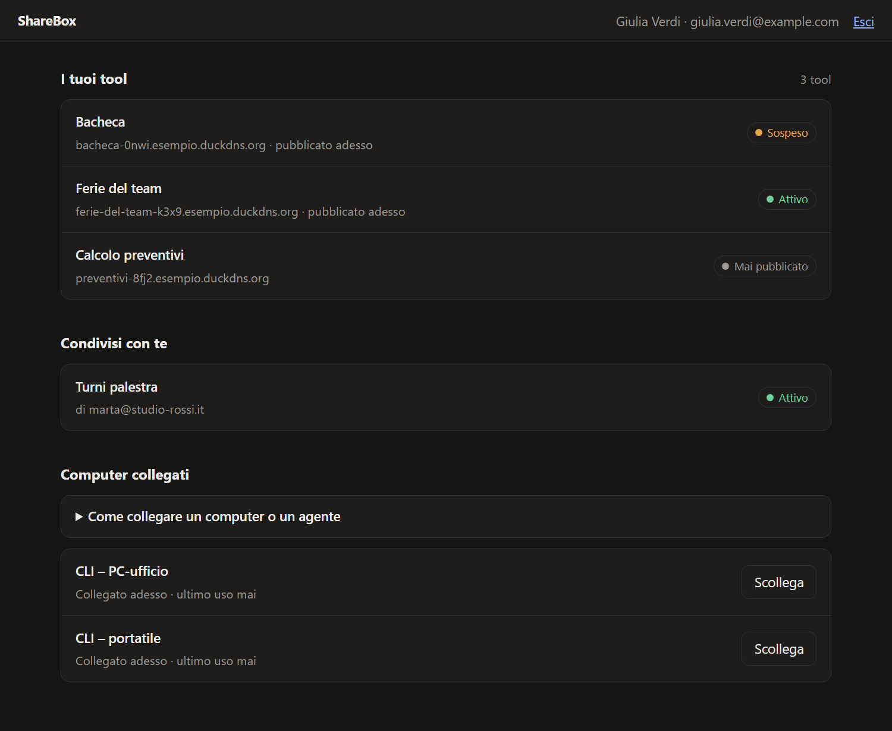
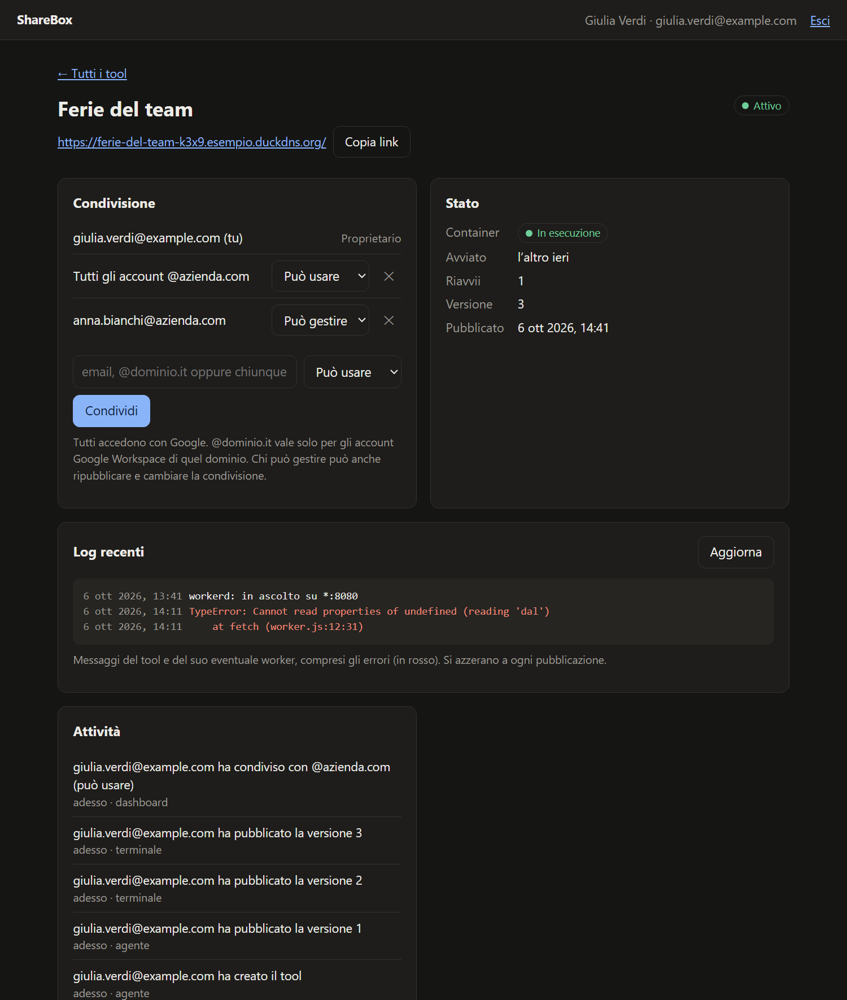

<div align="center">

# ShareBox

**Pubblica e condividi piccoli tool web creati con agenti AI, semplice come condividere un Google Doc.**

[](https://github.com/zalaso/sharebox/actions/workflows/ci.yml)
[](LICENSE)


[English](README.md) · **Italiano**



</div>

---

Oggi chiunque può farsi creare un piccolo tool da un agente AI: un tracker delle ferie, un modulo, una dashboard. La parte difficile è metterlo online e condividerlo *in modo sicuro*: hosting, dominio, HTTPS, login, database, permessi.

ShareBox toglie tutto questo. L'agente costruisce il tool e lo pubblica con un comando; tu ricevi un link e lo condividi con persone precise, con un intero dominio aziendale o con chiunque abbia il link. Chi lo apre accede con Google. Il tool riceve nome ed email di chi lo usa senza scrivere una riga di login, salva i dati nel proprio database e gira nella propria sandbox.

> *"Creami un tracker delle ferie del team e pubblicalo."*
> → l'agente lo scrive, lo pubblica e risponde con `https://ferie-del-team-k3x9.tuo-dominio-tool.org` → lo condividi con `@tuaazienda.it` → i colleghi lo aprono, accedono con Google e inseriscono le loro ferie.

ShareBox è **self-hosted**: installi la tua istanza su un piccolo server Linux, con i tuoi domini, il tuo login Google e i tuoi utenti. È indipendente da qualunque altra istanza.

## Cosa fa

- **Pubblicazione con un comando**, da terminale (`sharebox publish`) o direttamente da un agente AI tramite il **server MCP** incluso. Ogni tool riceve un indirizzo HTTPS proprio; ripubblicare aggiorna lo stesso tool e ne conserva i dati.
- **Privato per impostazione predefinita, condiviso come un documento**: persone precise (email), tutti gli account Google Workspace di un dominio, oppure chiunque abbia il link, ciascuno con ruolo *può usare* o *può gestire*. Le revoche valgono dalla richiesta successiva.
- **Login con Google gestito dalla piattaforma**: il tool non implementa nessun login e riceve un'identità affidabile (nome, email, ruolo).
- **Dati inclusi**: ogni tool ha il suo database SQLite. Le pagine statiche usano un piccolo SDK con permessi applicati lato server (`sharebox.collection("ferie").add({...})`); i tool con codice server hanno accesso SQL diretto.
- **Isolamento forte**: ogni tool gira nella propria sandbox [gVisor](https://gvisor.dev) con [workerd](https://github.com/cloudflare/workerd), rete propria, codice in sola lettura e limiti di CPU, memoria e processi. Un solo piccolo processo separato può comandare Docker.
- **Dashboard web** per condivisione, stato, log, attività, sospensione ed eliminazione, con i comandi pronti da copiare per collegare computer e agenti.
- **Backup giornalieri**, anche con copia cifrata su Google Drive.
- **Costa poco**: gira su una VPS da circa 4 €/mese; il dominio dei tool può essere un sottodominio DuckDNS gratuito.



## Come funziona

```
Internet ─▶ Caddy (HTTPS) ─▶ platform: login Google, permessi, API, dashboard, gateway
                                 │                         │
                                 │ rete interna            │ una rete interna per tool
                                 ▼                         ▼
                           orchestrator              sandbox gVisor + workerd (una per tool)
                           (unico con Docker)        file statici, SDK, worker del creatore, SQLite
```

Ogni richiesta a un tool passa dal gateway, che verifica sessione e permessi, toglie tutto ciò che un browser potrebbe falsificare e inietta l'identità di chi visita. I tool non raggiungono gli altri tool, la piattaforma, il server o internet. Progetto e motivazioni: [docs/architettura.md](docs/architettura.md) e le decisioni in [docs/adr/](docs/adr/).

## Partire subito

**Serve:** un server Ubuntu 24.04 (2 GB di RAM bastano per iniziare) con le porte 80/443 libere, un dominio per la piattaforma (es. `sharebox.esempio.it`), un dominio per i tool (un sottodominio [DuckDNS](https://www.duckdns.org) gratuito o un dominio su Cloudflare) e un client OAuth di Google.

Sul server, da root:

```bash
git clone https://github.com/zalaso/sharebox /opt/sharebox && cd /opt/sharebox && bash deploy/install.sh
```

L'installatore configura Docker e gVisor, chiede domini e credenziali (i segreti non vengono mostrati), controlla DNS, porte e firewall, costruisce tutto dal codice sorgente, avvia i servizi e programma i backup notturni.

Poi, sul tuo computer (Node 20 o più recente), installa la CLI **dalla tua istanza** e collegala: si apre il browser per confermare.

```bash
npm install -g https://sharebox.esempio.it/cli/sharebox.tgz
```

```bash
sharebox login sharebox.esempio.it
```

E dai gli strumenti al tuo agente (qui Claude Code; su Windows usa `-- cmd /c sharebox mcp`):

```bash
claude mcp add --scope user sharebox -- sharebox mcp
```

Guida passo per passo, compresi DNS e Google: **[docs/installazione.md](docs/installazione.md)**.

## Costruire un tool

Un agente collegato via MCP legge la guida inclusa (`sharebox_guida`) e sa cosa fare. A mano:

```bash
sharebox init ferie --name "Ferie del team"   # modello di partenza con un esempio di SDK
sharebox publish ferie                        # → https://ferie-del-team-xxxx.<dominio dei tool>/
sharebox share ferie @tuaazienda.it           # oppure l'email di una persona, oppure "chiunque"
```

Un tool è una cartella con `public/` (HTML, CSS, JS) e, se serve, un `worker.ts` per il codice lato server:

```html
<script src="/__sharebox/sdk.js"></script>
<script>
  const io = await sharebox.me();                 // { email, name, role }
  const ferie = sharebox.collection("ferie");
  await ferie.add({ dal: "2026-08-01", al: "2026-08-15" });
  const tutte = await ferie.list();               // record con proprietario e canEdit
</script>
```

Con *può usare* si modificano solo i propri record, con *può gestire* tutti: lo controlla il server. Guida completa della CLI: [docs/cli.md](docs/cli.md).

## Stato del progetto

Progetto giovane, in uso sull'istanza privata dell'autore. Funziona oggi: pubblicazione, condivisione, dati, CLI, MCP, dashboard, backup, installatore self-hosted, CI.

Limiti noti e prossimi passi:
- **L'interfaccia (dashboard, CLI, pagine) è solo in italiano**: le traduzioni sono benvenute.
- Un solo server: circa 25 tool accesi insieme con 2 GB di RAM; è previsto lo spegnimento dei tool inattivi.
- I tool non possono ancora chiamare API esterne (niente internet, niente segreti): previsto, tramite un proxy in uscita.
- Login solo con Google; pubblicano solo le email elencate in `CREATOR_EMAILS`.

## Documentazione

| | |
|---|---|
| [Installare la propria istanza](docs/installazione.md) · [Install (English)](docs/install.md) | Requisiti, DNS, Google, installatore |
| [Gestire un'installazione](deploy/README.md) | Aggiornamenti, amministrazione, verifiche, backup |
| [Ripristino da backup](deploy/backup/RIPRISTINO.md) | |
| [CLI e MCP](docs/cli.md) | |
| [Architettura](docs/architettura.md) e [decisioni](docs/adr/) | |

## Contribuire

Segnalazioni, idee e pull request sono benvenute: vedi [CONTRIBUTING.md](CONTRIBUTING.md). Le vulnerabilità vanno segnalate in privato: [SECURITY.md](SECURITY.md).

## Licenza

[GNU AGPL v3](LICENSE) o successiva. Puoi usare, studiare, modificare e redistribuire ShareBox, anche per offrire un servizio; se offri un servizio basato su una versione modificata, devi rendere disponibile il codice delle tue modifiche ai suoi utenti.
