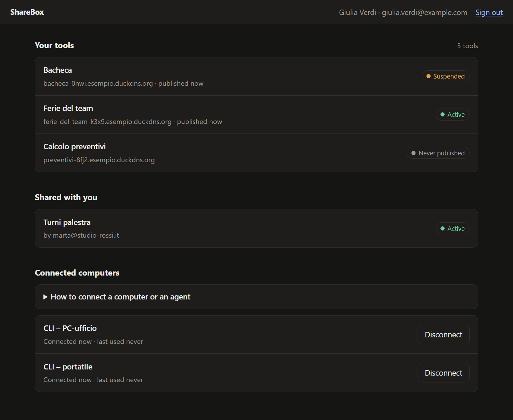
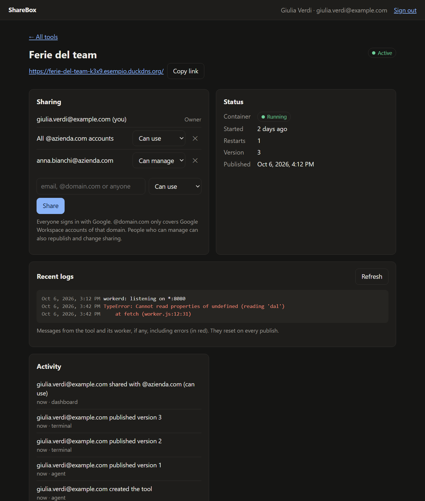
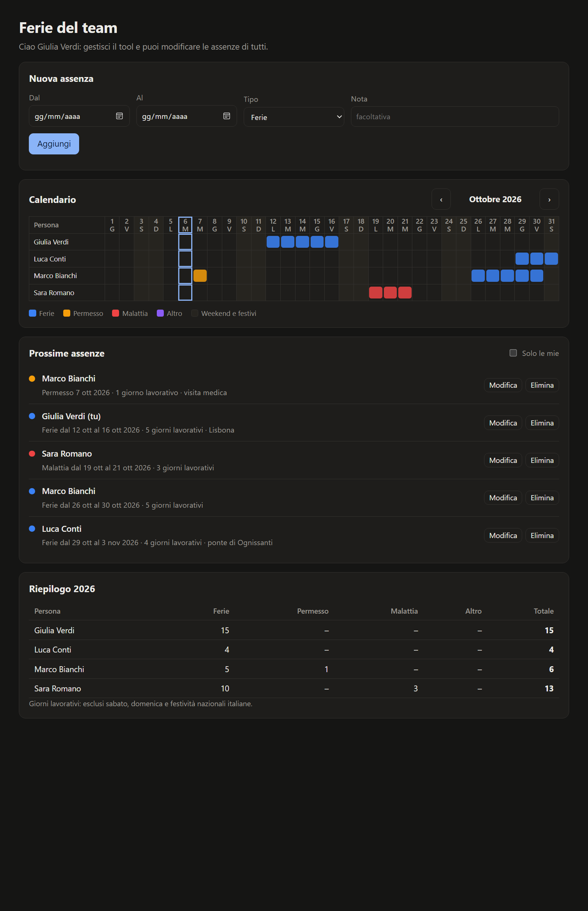

<div align="center">

# ShareBox

**Publish and share small web tools built by AI agents — as easily as sharing a Google Doc.**

[](https://github.com/zalaso/sharebox/actions/workflows/ci.yml)
[](LICENSE)


**English** · [Italiano](README.it.md)


</div>

---

Anyone can now ask an AI agent for a small tool — a team vacation tracker, a form, a dashboard. Putting it online and sharing it *safely* is the hard part: hosting, domain, HTTPS, login, database, permissions.

ShareBox removes all of that. Your agent builds the tool and publishes it with one command; you get a link and share it with specific people, a whole company domain, or anyone with the link. Visitors sign in with Google. The tool gets their name and email for free, stores its data in its own database, and runs in its own sandbox.

> *"Build a vacation tracker for my team and publish it."*
> → the agent writes it, publishes it, and replies with `https://vacation-tracker-k3x9.your-tools-domain.org` → you share it with `@yourcompany.com` → colleagues open it, sign in with Google, and add their days off.

ShareBox is **self-hosted**: you run your own instance on a small Linux server, with your domains, your Google login and your users. It is independent from any other instance.

## Features

- **One-command publishing** from a terminal (`sharebox publish`) or straight from an AI agent through the bundled **MCP server**. Every tool gets its own HTTPS address; republishing updates the same tool and keeps its data.
- **Private by default, shared like a document**: specific people (email), every Google Workspace account of a domain, or anyone with the link — each as *can use* or *can manage*. Revocations apply on the very next request.
- **Google sign-in handled by the platform**: tools implement no login and receive a trusted identity (name, email, role).
- **Built-in storage**: every tool has its own SQLite database. Static pages use a tiny SDK with server-side permissions (`sharebox.collection("vacations").add({...})`); tools with server code get direct SQL access.
- **Strong isolation**: each tool runs in its own [gVisor](https://gvisor.dev) sandbox with [workerd](https://github.com/cloudflare/workerd), its own network, read-only code and CPU/memory/process limits. Only one small, separate process may talk to Docker.
- **Web dashboard** for sharing, status, logs, activity, suspension and deletion — plus ready-to-copy commands to connect your computer and your agents.
- **Daily backups**, optionally copied to Google Drive encrypted.
- **Cheap**: runs on a ~4 €/month VPS; the tools' domain can be a free DuckDNS subdomain.





## How it works

```
Internet ─▶ Caddy (HTTPS) ─▶ platform: Google login, permissions, API, dashboard, gateway
                                 │                         │
                                 │ internal network        │ one internal network per tool
                                 ▼                         ▼
                           orchestrator              gVisor sandbox + workerd (one per tool)
                           (only one with Docker)    static files, SDK, creator's worker, SQLite
```

Every request to a tool goes through the gateway, which checks the session and the permissions, strips anything a browser could forge and injects the visitor's identity. Tools cannot reach each other, the platform, the host or the internet. Design and rationale: [docs/architettura.md](docs/architettura.md) and the decision records in [docs/adr/](docs/adr/) (in Italian).

## Quick start

**You need:** an Ubuntu 24.04 server (2 GB RAM is enough to start) with ports 80/443 free, a domain for the platform (e.g. `sharebox.example.com`), a domain for the tools — a free [DuckDNS](https://www.duckdns.org) subdomain or a domain on Cloudflare — and a Google OAuth client.

On the server, as root:

```bash
git clone https://github.com/zalaso/sharebox /opt/sharebox && cd /opt/sharebox && bash deploy/install.sh
```

The installer sets up Docker and gVisor, asks for your domains and credentials (secrets are not echoed), checks DNS, ports and firewall, builds everything from source, starts it and schedules nightly backups.

Then, on your computer (Node 20+), install the CLI and connect it — your browser opens to confirm:

```bash
npm install -g sharebox-cli
```

(Each instance also serves a copy matching its own version: `npm install -g https://sharebox.example.com/cli/sharebox.tgz`.)

```bash
sharebox login sharebox.example.com
```

And give your agent the tools (Claude Code shown; on Windows use `-- cmd /c sharebox mcp`):

```bash
claude mcp add --scope user sharebox -- sharebox mcp
```

Step-by-step guide, including DNS and Google setup: **[docs/install.md](docs/install.md)**.

## Building a tool

An agent connected through MCP reads the built-in guide (`sharebox_guide`) and knows what to do. By hand:

```bash
sharebox init vacation-tracker --name "Vacation tracker"   # starter with an SDK example
sharebox publish vacation-tracker                           # → https://vacation-tracker-xxxx.<tools domain>/
sharebox share vacation-tracker @yourcompany.com            # or a person's email, or "chiunque" (anyone)
```

A tool is a folder with `public/` (HTML, CSS, JS) and, optionally, a `worker.ts` for server code:

```html
<script src="/__sharebox/sdk.js"></script>
<script>
  const me = await sharebox.me();                 // { email, name, role }
  const days = sharebox.collection("vacations");
  await days.add({ from: "2026-08-01", to: "2026-08-15" });
  const all = await days.list();                  // records with owner and canEdit
</script>
```

Users with *can use* edit only their own records; *can manage* edits everything — enforced on the server. Full CLI reference: [docs/cli.md](docs/cli.md).

**Complete example:** [`examples/ferie`](examples/ferie) — the team vacation tracker from the demo, built by an agent through MCP: team calendar, upcoming absences with working-day counts (Italian public holidays included), yearly summary. Plain HTML/CSS/JS, no dependencies.



## Status

Young project, running on the author's private instance. Working today: publishing, sharing, storage, CLI, MCP, dashboard, backups, self-hosted installer, CI.

Known limitations and next steps:
- The interface (dashboard, pages, CLI, installer) is in English and Italian, picked from the browser or system language. Other languages are welcome: the dictionaries are in `packages/platform/src/messages.ts`, `packages/platform/dashboard/app.js`, `packages/runtime/src/messages.ts` and `packages/cli/src/i18n.ts`.
- Single server: about 25 tools running at once on 2 GB of RAM; stopping idle tools is planned.
- Tools cannot call external APIs yet (no internet access, no secrets) — planned, behind an egress proxy.
- Sign-in with Google only; publishing is limited to the e-mails listed in `CREATOR_EMAILS`.

## Documentation

| | |
|---|---|
| [Install your own instance](docs/install.md) · [Installazione](docs/installazione.md) | Requirements, DNS, Google, installer |
| [Running an instance](deploy/README.md) | Updates, administration, checks, backups *(Italian)* |
| [Restore from backup](deploy/backup/RIPRISTINO.md) | *(Italian)* |
| [CLI and MCP](docs/cli.md) | *(Italian)* |
| [Architecture](docs/architettura.md) and [decisions](docs/adr/) | *(Italian)* |

## Contributing

Bug reports, ideas and pull requests are welcome — see [CONTRIBUTING.md](CONTRIBUTING.md). Please report security issues privately: [SECURITY.md](SECURITY.md).

## License

[GNU AGPL v3](LICENSE) or later. You may use, study, modify and redistribute ShareBox, including to run a service; if you run a service on a modified version, you must make your changes available to its users.
